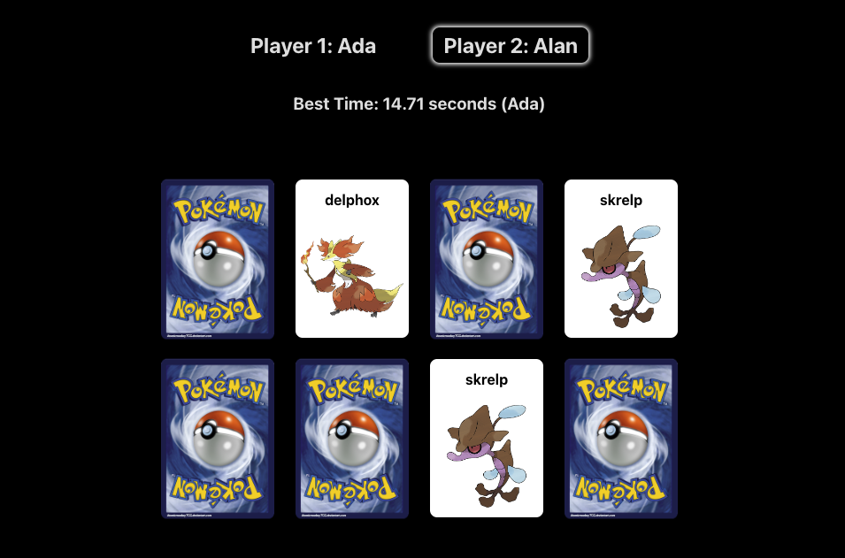
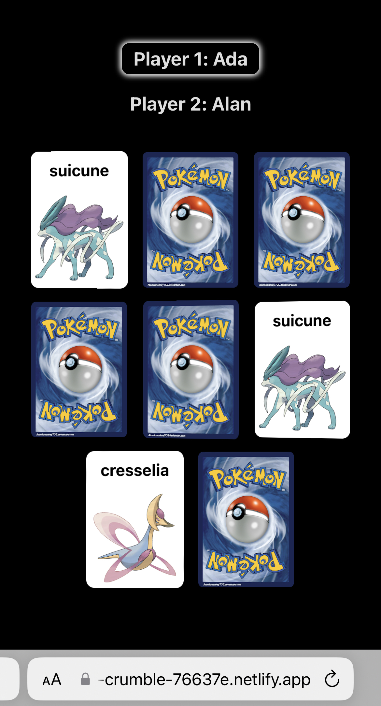

# Memory Game

This game is the classic memory card game 'Matching pairs' played using Pokemon.

The game allows for two players. Each player tries to match pairs of cards in the fastest time possible.

**Website is live <a href="https://calm-crumble-76637e.netlify.app/">here</a>**

## Screenshots

### Gameplay:

### iPhone 13 Gameplay:

## Project Purpose

I built this project to learn React, in particular focusing on state management, API calls, hooks (useState, useEffect and custom hooks) and writing clean React code.

## Technologies Used

-   **Web Basics**:

    -   HTML/CSS/JavaScript

-   **Frameworks & Tools**:

    -   React
    -   Vite
    -   Netlify
    -   Chrome DevTools

-   **Libraries**:
    -   Jotai
    -   Lodash
    -   uuid

## How It Works

The game works by randomly choosing Pokemon from the Pokeapi.co API, then doubling them so each Pokemon has a matching pair. Care is taken to ensure that each Pokemon sampled from the API is unique.

## Challenges and Lessons Learnt

**Managing State**:

-   One of the biggest lessons learnt during this project was thinking carefully about the way to structure state before beginning to code. At first I had several different state variables to track each Card components visibility, activity status etc, however the code became hard to read and understand.

-   Instead I figured it would be easier to group related state together into an object. Thus I created a gameState object to maintain the state of the game such as the current player, if the game is loaded, if it is started etc. I also grouped the Card state into its own object which manages the state of each cards pokemon name, image url, visibility etc.

-   I found many of the components used the game state object and prop drilling and destructing this object in many components made the code hard to read. As such I decided to refactor this state object to a global state object using
    <b>Jotai</b>. Doing so lead to more readable and maintainable code.

 

**Code Review and Refactoring**:

During the project, I discovered that the journey of writing good code mirrors that of creative writing. The initial code isn't about attaining perfection right off the bat, but viewing it as a "first draft." This perspective allowed me to revisit, edit, and refine my code progressively.

<b>Key Improvements:</b>

-   **Variable Names**:

    -   Refined variable names to improve clarity.

-   **Magic Numbers**:

    -   Replaced magic numbers with descriptive constants.

-   **Function Refactoring**:

    -   Refactor functions with the <i>Single Responsibility Principle</i> in mind.

-   **Code Reusability**:

    -   Centralized repetitive logic into reusable functions.

-   **Component Breakdown**:
    -   Broke down larger subcomponents for better granularity and modularity.

## Improvements and Future Features
- Adding certain state to localStorage so that it persists between page refreshes. The highscore would be a good candidate for this. 

- Adding a user sign in and backend to store a user and their data.

- Using WebSockets to allow two players to verse each other in real time with the same set of cards.

- Although I initially designed the project for responsiveness using Chrome DevTools' "Device Toolbar" (to simulate various devices) and employed CSS media queries, flexbox, and grid, I observed discrepancies in actual performance. Specifically, on my iPhone, there were noticeable differences between browsers. For instance, animations rendered less smoothly on Chrome compared to Safari, highlighting areas for optimization.